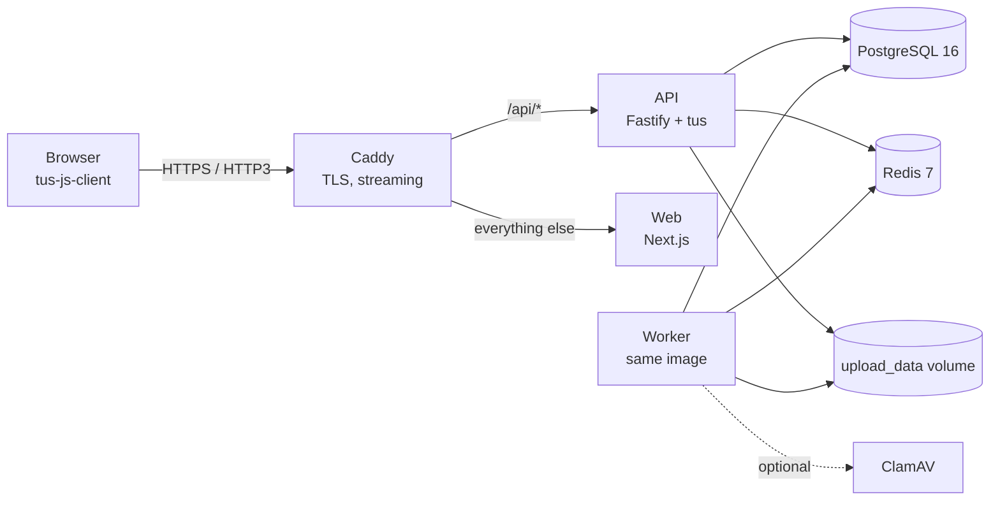

# Scenox Vault

**Self-hosted, high-speed client data intake.** Create a secure upload portal for each client, let them drop in 100+ GB of footage, folders or archives over a resumable connection, and manage everything from one admin dashboard — on your own server, with your own disks.

> Uploads use the open [tus 1.0](https://tus.io) resumable protocol over HTTPS. Close the laptop, lose Wi-Fi, switch networks: the upload continues from the last byte the server received.

## Features

| Area | What you get |
|---|---|
| **Portals** | One secret link per client/project (192-bit random token), optional expiry date, optional password, per-portal size / quota / extension rules, custom title, instructions and logo, intake fields (name, e-mail, company, message) |
| **Uploads** | Multiple files, huge files, whole folders (structure preserved), drag & drop, 64 MB resumable chunks, 4 parallel files (adaptive), automatic retry with exponential backoff, resume after refresh / reconnect, live progress, speed and ETA |
| **Admin** | Dashboard, clients, portals, upload sessions, file browser with server-side search, download (HTTP range) and bulk ZIP export, rename / move / delete, activity feed, audit log, team roles (owner / admin / member / viewer), settings & branding |
| **Storage** | Streaming to disk (never buffered in RAM), per-client and per-portal quotas, disk-usage monitoring with warning thresholds, SHA-256 checksums, duplicate detection, retention clean-up |
| **Safety** | Argon2id passwords, DB-backed HttpOnly sessions, CSRF origin checks, Redis rate limits, account lockout, extension block-list, magic-byte MIME detection, optional ClamAV scanning + quarantine, path-traversal-proof storage keys, secrets redacted from logs |
| **Notifications** | In-app + SMTP e-mail when uploads complete or fail, optional client receipt |
| **Operations** | One `docker compose up`, automatic HTTPS (Caddy), HTTP/2 + HTTP/3, automatic DB migrations, health endpoints, backup / restore / update scripts, GitHub Actions CI |

## How it fits together



Details: [docs/ARCHITECTURE.md](docs/ARCHITECTURE.md).

## Quick start — local development

Requirements: Node 22, pnpm 10 (`corepack enable`), Docker.

```bash
docker compose -f docker-compose.dev.yml up -d     # Postgres 16 + Redis 7 (add --profile mail for Mailpit)
cp .env.example .env                               # defaults already point at the dev containers
pnpm install
pnpm db:migrate

pnpm --filter @scenox/api dev            # API + tus on :4000
pnpm --filter @scenox/api dev:worker     # background jobs (checksums, scans, ZIPs, e-mail)
pnpm --filter @scenox/web dev            # web on :3000
pnpm dev:proxy                           # :8080 → /api to :4000, everything else to :3000 (mirrors Caddy)
```

Open <http://localhost:8080/setup> to create the owner account. Then create a client and a portal and open the portal link in a private window.

Always use :8080 in development. Next.js's built-in `/api` rewrite on :3000 buffers request bodies (10 MB cap), so large uploads must go through the streaming dev proxy, just as they go through Caddy in production.

Handy: `pnpm typecheck`, `pnpm test` (API tests need the dev Postgres; they use the `scenox_test` database — `createdb`/`CREATE EXTENSION pg_trgm` as in [CI](.github/workflows/ci.yml)), `pnpm db:generate` after editing `apps/api/src/db/schema.ts`.

## Quick start — production (Ubuntu 22.04 / 24.04 VPS)

1. Point two DNS records (`app.example.com` and `upload.example.com`, or a single one) at the server.
2. Run the installer:

   ```bash
   git clone <your-repo-url> scenox-vault && cd scenox-vault
   sudo bash deploy/scripts/install.sh
   ```

   It installs Docker, generates all secrets into `.env`, opens the firewall (22, 80, 443/tcp, 443/udp) and starts the stack.
3. Visit `https://app.example.com/setup` and create the owner account.
4. Schedule backups: `0 3 * * * /opt/scenox-vault/deploy/scripts/backup.sh >> /var/log/scenox-backup.log 2>&1`

Manual route, Cloudflare caveats, ClamAV, SMTP, S3 and troubleshooting: **[docs/DEPLOYMENT.md](docs/DEPLOYMENT.md)**.

## Repository layout

```
apps/
  api/                 Fastify 5 API, tus server, BullMQ worker, Drizzle schema + migrations
    src/{routes,services,jobs,storage,queue,db,plugins,lib}
    drizzle/           generated SQL migrations (shipped in the image)
    Dockerfile         one image for `api` and `worker`
  web/                 Next.js 16 (standalone output): admin UI + client upload portal
    Dockerfile
packages/
  shared/              DTO types, constants, RBAC, filename sanitising (used by api + web)
deploy/
  Caddyfile            reverse proxy: automatic HTTPS, streaming, HTTP/3
  nginx.conf.example   alternative proxy configuration
  scripts/             install.sh  backup.sh  restore.sh  update.sh  healthcheck.sh
scripts/
  upload-bench.mjs     tus upload performance harness
docs/                  architecture, upload engine, deployment, security, performance, privacy, API
docker-compose.yml     production stack
docker-compose.dev.yml local Postgres + Redis (+ Mailpit)
.env.example           every setting, documented
```

## Documentation

| Document | Read it for |
|---|---|
| [docs/ARCHITECTURE.md](docs/ARCHITECTURE.md) | components, database schema, upload lifecycle, storage layout, scaling path, technology choices |
| [docs/UPLOAD_ENGINE.md](docs/UPLOAD_ENGINE.md) | tus usage, chunking, parallelism, retries, resume, failure modes, tuning, bottlenecks |
| [docs/DEPLOYMENT.md](docs/DEPLOYMENT.md) | VPS setup, DNS, HTTPS, env reference, updates, backup/restore, capacity planning, troubleshooting |
| [docs/SECURITY.md](docs/SECURITY.md) | threat model, controls, rate limits, retention, security test checklist |
| [docs/PERFORMANCE_TESTING.md](docs/PERFORMANCE_TESTING.md) | how to benchmark with `scripts/upload-bench.mjs`, results template |
| [docs/PRIVACY.md](docs/PRIVACY.md) | what personal data is stored and for how long |
| [docs/API.md](docs/API.md) | HTTP API reference |

Benchmark harness help: `node scripts/upload-bench.mjs --help`.

## Production checklist

Tick these on your own server before going live. Each item is something the platform is designed to do; verify it end to end on your deployment.

**Accounts & portals**
- [ ] Owner can log in; wrong password is rejected; lockout after repeated failures
- [ ] Can create, edit, disable and delete clients
- [ ] Can create portals; the portal URL is a long random secret link
- [ ] Expired and disabled portals refuse uploads; password-protected portals ask for the password
- [ ] Regenerating a link kills the old one immediately

**Uploading**
- [ ] Multiple files, a very large file (>10 GB), and a folder upload all succeed
- [ ] Chunked: the network tab shows `PATCH /api/tus/...` requests of the configured chunk size
- [ ] Resume: pull the network cable / reload the page mid-upload — it continues, not restarts
- [ ] Retry: block the connection briefly — automatic retries then success
- [ ] Parallel uploads run (default 4 files); progress, speed and ETA are shown
- [ ] Disallowed extensions, oversize files and quota overruns are rejected *before* bytes are sent

**Admin**
- [ ] Uploaded files appear in the admin with correct names, sizes, checksums and folders
- [ ] Download works (including resume/range) and bulk ZIP export works
- [ ] Delete removes the file from disk and from the quota counters
- [ ] Search finds files by name; client/portal quotas are enforced and shown
- [ ] Completion e-mails / in-app notifications arrive; activity and audit logs record actions

**Platform**
- [ ] `https://APP_DOMAIN` has a valid certificate; HTTP redirects to HTTPS; `/api/ready` returns `ok`
- [ ] `docker compose restart` / server reboot keeps all files, accounts and queued jobs
- [ ] Migrations ran automatically on first start (`docker compose logs api | grep migrations`)
- [ ] `backup.sh` produces a dump; a **test restore** into a scratch server succeeds
- [ ] `.env` is mode 600, not committed, contains no placeholder (`CHANGE_ME`) values
- [ ] Postgres and Redis are not reachable from the internet (`nmap` shows only 22/80/443)
- [ ] No fake or demo functionality is exposed: every button in the UI does what it says
