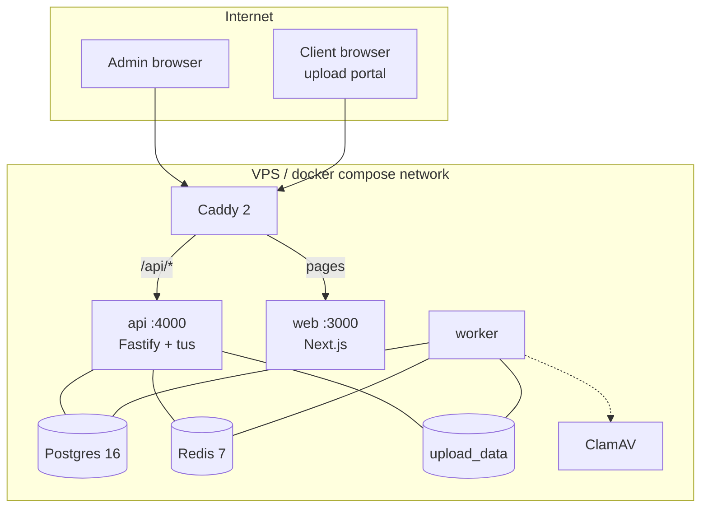
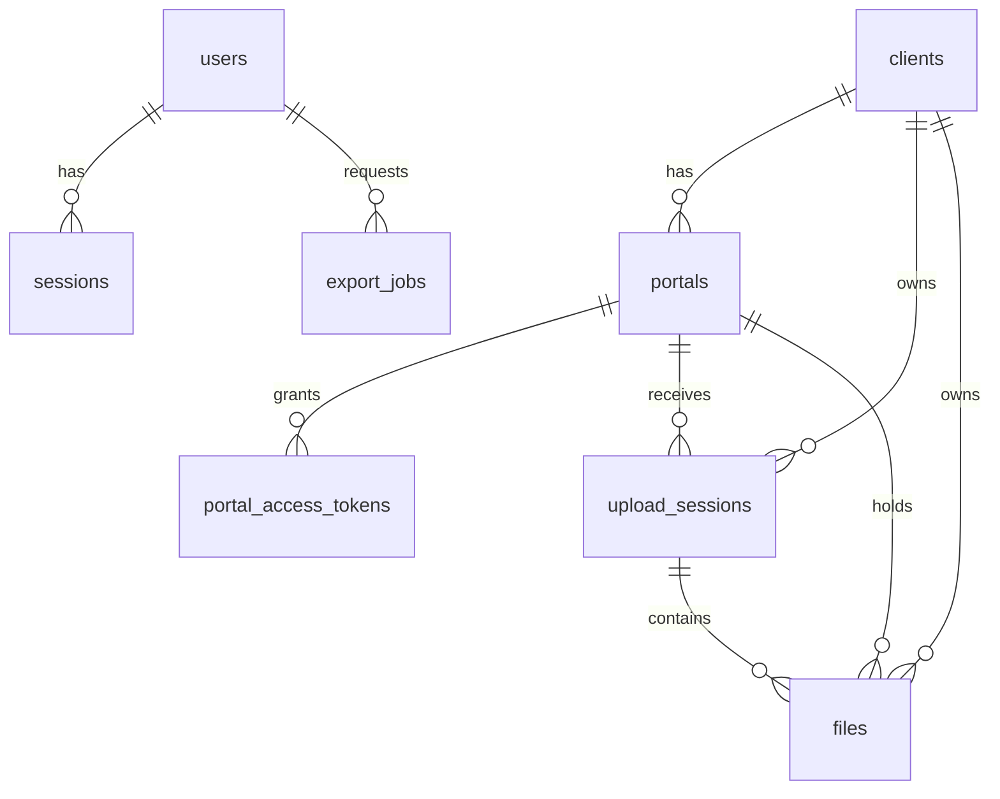
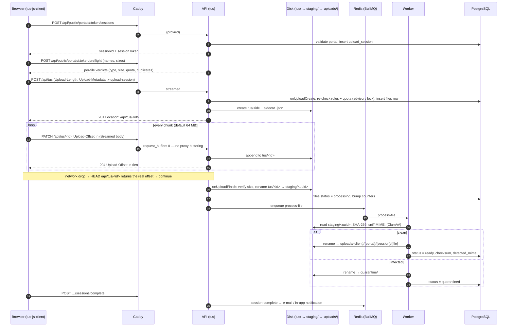

# Architecture

Scenox Vault is a small, conventional web stack with one unusual requirement: **accept very large uploads reliably from unreliable networks, onto a single self-hosted server.** Every decision below serves that.

## 1. System overview

```
                           Internet
                              │  HTTPS (TLS 1.3, HTTP/2, HTTP/3)
                              ▼
 ┌────────────────────────────────────────────────────────────────────┐
 │ Caddy 2          :80 :443/tcp :443/udp                             │
 │   app.example.com ┐                                                │
 │   upload.example.com ┘   /api/*  ──► api:4000     (streamed, no     │
 │                          other   ──► web:3000      body limit)      │
 └──────────────┬──────────────────────────┬──────────────────────────┘
                │                          │
        ┌───────▼────────┐         ┌───────▼────────┐
        │ api            │         │ web            │
        │ Fastify 5      │         │ Next.js 16     │
        │ + @tus/server  │         │ (standalone)   │
        └─┬────┬────┬────┘         └────────────────┘
          │    │    │
          │    │    └──────────────► upload_data volume  /data/storage
          │    │                       tus/ staging/ uploads/ quarantine/ exports/ branding/
          │    │                              ▲
          │    └────────► Redis 7 ◄──┐        │
          ▼                          │        │
     PostgreSQL 16            ┌──────┴────────┴──┐       ┌────────────┐
                              │ worker           │──────►│ ClamAV     │ (optional,
                              │ same image as api│ TCP   │ clamd:3310 │  profile "clamav")
                              └──────────────────┘       └────────────┘
```



### Services

| Service | Image | Port | Role |
|---|---|---|---|
| `caddy` | `caddy:2-alpine` | 80, 443/tcp, 443/udp (only published ports) | TLS (automatic certificates), HTTP/2 + HTTP/3, routing, streaming reverse proxy |
| `web` | `apps/web/Dockerfile` | 3000 | Next.js admin UI and client portal; hides admin routes on the upload host |
| `api` | `apps/api/Dockerfile` | 4000 | REST API, tus endpoint at `/api/tus`, authorised downloads, runs migrations at start |
| `worker` | same image, `node dist/worker.js` | – | BullMQ consumers: checksum, MIME sniff, virus scan, notifications, ZIP exports, cleanup |
| `postgres` | `postgres:16-alpine` | internal | system of record (metadata only — never file bytes) |
| `redis` | `redis:7-alpine` | internal | BullMQ queues, distributed rate limiting |
| `clamav` | `clamav/clamav` | internal 3310 | optional virus scanner (`--profile clamav`) |

### Domains and routing

`APP_DOMAIN` (admin, e.g. `app.example.com`) and `UPLOAD_DOMAIN` (clients, e.g. `upload.example.com`) are both served by Caddy. On each, `/api/*` goes to the API and everything else to the web app — **same origin, so no CORS is needed**. The web app's proxy (`apps/web/src/proxy.ts`) returns 404 for admin routes when the request host equals `UPLOAD_HOST`, so clients never see the dashboard. Single-domain mode works too: set `UPLOAD_DOMAIN=APP_DOMAIN` and leave `UPLOAD_HOST` empty.

## 2. Components

### API (`apps/api`)

Fastify 5 + TypeScript, bundled with tsup to `dist/`. Layers: `routes/` (HTTP, validation) → `services/` (business logic, SQL via Drizzle) → `storage/` + `queue/`. Cross-cutting plugins: helmet, strict CORS allow-list, cookies, `@fastify/rate-limit` (opt-in per route, backed by Redis), authentication/CSRF plugin. JSON bodies are capped at 2 MiB; **upload bytes never pass through Fastify's body parser** — the tus route hijacks the raw Node request and `@tus/server` streams it to disk.

### Worker (`apps/api/src/worker.ts`)

Same code and image as the API with a different command. Queues (BullMQ on Redis):

| Queue | Jobs | Work |
|---|---|---|
| `file-processing` | `process-file` | SHA-256 of the staged file, magic-byte MIME sniff (`file-type`), duplicate detection, optional ClamAV scan, move to `uploads/…` (clean) or `quarantine/…` (infected) |
| `notifications` | `session-complete`, `send-notification` | build and send "upload completed" e-mails, in-app notifications |
| `exports` | `build-zip` | stream selected files into a ZIP under `exports/` |
| `maintenance` | `cleanup`, `storage-check` | abandoned tus uploads, stale sessions, expired exports, retention, disk-usage alerts |

Jobs retry 5× with exponential backoff (2 s base). Nothing in the upload hot path waits on a job.

### Web (`apps/web`)

Next.js 16 (App Router), React 19, Tailwind 4, TanStack Query. Build output is `standalone` (a minimal Node server). The upload engine runs in the browser (`src/lib/upload`): tus-js-client, an adaptive concurrency pool, IndexedDB persistence — see [UPLOAD_ENGINE.md](UPLOAD_ENGINE.md).

### Shared (`packages/shared`)

DTO types, constants (`UPLOAD_DEFAULTS`, header names, blocked extensions), RBAC permission table, filename/path sanitising. One source of truth compiled into both apps.

## 3. Database schema

PostgreSQL 16, Drizzle ORM, migrations in `apps/api/drizzle/` applied automatically at API start (`MIGRATE_ON_START=false` disables). All primary keys are UUIDs (`gen_random_uuid()`), timestamps are `timestamptz`, byte counts are `bigint`. **File content never lives in Postgres.** Extension `pg_trgm` powers fuzzy name search.



| Table | Purpose | Key columns | Indexes |
|---|---|---|---|
| `users` | admin accounts | `email`, `name`, `password_hash` (Argon2id), `role` (owner/admin/member/viewer), `status`, `failed_login_count`, `locked_until`, `last_login_at` | unique `lower(email)` |
| `sessions` | admin login sessions | `user_id`→users, `token_hash`, `ip`, `user_agent`, `expires_at`, `last_seen_at` | unique `token_hash`; `user_id`; `expires_at` |
| `clients` | customers of the agency | `name`, `company`, `email`, `status`, `quota_bytes`, counters `storage_used_bytes`, `file_count`, `upload_count`, `last_upload_at` | `status`; `created_at`; GIN trigram on `name` |
| `portals` | secure upload links | `client_id`→clients, `token_hash` (HMAC), `token_encrypted` (AES-GCM), `token_preview`, `status`, `expires_at`, `password_hash`, `max_file_size_bytes`, `max_total_bytes`, `allowed_extensions[]`, `require_*` intake flags, `allow_folders/zip/resume/client_view/client_delete`, `notify_emails[]`, counters | unique `token_hash`; `client_id`; `status`; `created_at` |
| `portal_access_tokens` | short-lived grants after portal password | `portal_id`, `token_hash`, `ip`, `expires_at` | unique `token_hash`; `portal_id` |
| `upload_sessions` | one visit/batch by a client | `portal_id`, `client_id`, `token_hash`, `status` (active/completed/abandoned/failed), `uploader_name/email/company`, `message`, `ip`, `user_agent`, totals (`total_files`, `total_bytes`, `uploaded_*`, `failed_files`), `avg_speed_bps`, `expires_at`, `notified_at` | unique `token_hash`; `portal_id`; `client_id`; `status`; `started_at`; `last_activity_at` |
| `files` | one row per uploaded file | `client_id`, `portal_id`, `upload_session_id`, `tus_id`, `original_filename`, `stored_filename` (UUID), `relative_path`, `extension`, `mime_type`, `detected_mime`, `size`, `bytes_received`, `checksum_sha256`, `status` (uploading/processing/ready/quarantined/failed/cancelled), `scan_status`, `scan_result`, `duplicate_of_id`, `storage_key`, `client_key`, `avg_speed_bps` | unique `tus_id`; `client_id`; `portal_id`; `upload_session_id`; `status`; `created_at`; `checksum_sha256`; `(client_id, relative_path, original_filename)`; GIN trigram on `original_filename` |
| `export_jobs` | bulk ZIP builds | `user_id`, `status`, `file_ids[]`, `progress`, `output_key`, `output_size`, `expires_at` | `user_id`; `status` |
| `activity_logs` | audit & activity trail | `actor_type` (user/client/system), `actor_id`, `actor_label`, `action`, `resource_type/id`, `client_id`, `portal_id`, `ip`, `user_agent`, `request_id`, `result`, `metadata` jsonb | `created_at`; `(client_id, created_at)`; `action`; `(actor_type, actor_id)` |
| `notifications` | e-mail + in-app notifications | `type`, `channel`, `recipient`, `subject`, `body`, `link`, `status`, `read_at`, `sent_at` | `created_at`; `status` |
| `settings` | JSON document per section (branding, notifications, security, retention, uploads) | `key` (PK), `value` jsonb, `updated_by` | – |

Counters on `clients`/`portals` are maintained transactionally by the upload pipeline, so dashboards never scan `files`.

## 4. Upload lifecycle



Key properties:

- **Validation before bytes.** Type, size and quota are enforced in `onUploadCreate`; a rejected file costs one tiny request, not 50 GB of bandwidth.
- **Quota safety.** Quota decisions are serialised per client with `pg_advisory_xact_lock`, counting in-flight uploads, so parallel creates cannot over-commit.
- **O(1) finalisation.** `tus/`, `staging/` and `uploads/` are on the same filesystem, so "moving" a 100 GB file is a `rename`, not a copy. If they were ever on different devices, the storage layer falls back to a streamed copy.
- **Crash safety.** tus state is on disk (offset = file size); the DB row tracks status. A restart mid-upload resumes at the same offset. Files stuck in `processing` are re-queued by the cleanup job.
- **No double processing.** The job id is `process-file-<fileId>`; status transitions are guarded in SQL.

## 5. Storage architecture

All paths are relative to `STORAGE_PATH` (`/data/storage` in containers, volume `upload_data`).

```
/data/storage
├── tus/                    in-progress uploads: <id> + <id>.json (tus sidecar)
├── staging/                finished uploads awaiting checksum / scan:   <uuid>
├── uploads/                permanent: uploads/{clientId}/{portalId}/{sessionId}/{fileId-uuid}
├── quarantine/             infected files (never downloadable)
├── exports/                temporary ZIPs (deleted after EXPORT retention, default 24 h)
└── branding/               portal / app logos (≤ 2 MB images)
```

- **Original file names live only in the database.** On disk everything is a UUID, so names can never cause traversal, collisions or encoding problems.
- **Keys are generated by the server**, and `LocalStorage.localPath()` resolves them against the root and refuses anything that escapes it.
- **Files are never served by the web server or Caddy.** Downloads go through authorised API routes that stream with `Range` support. Caddy additionally 404s `/data`, `/storage`, `/.env`, `/.git`.
- **Same filesystem rule:** `tus/` and `uploads/` MUST be on one filesystem. Moving to attached storage means moving the *whole* `STORAGE_PATH`, not individual folders.
- Directory mode `0750`, file mode `0640`, container runs as non-root user `node`.

The `StorageService` interface (`apps/api/src/storage/types.ts`) abstracts put/get/move/delete/capacity, plus multipart and signed-URL methods reserved for object storage. Only the `local` driver exists today.

## 6. Authentication & authorisation

| Actor | Credential | Notes |
|---|---|---|
| Admin user | cookie `sv_session` (random 256-bit token; only its HMAC is stored in `sessions`) | `HttpOnly`, `Secure` (when `APP_URL` is https), `SameSite=Lax`, absolute expiry (default 12 h, Settings → Security) |
| Client (portal) | the portal link `/u/<token>` (192-bit) | HMAC-SHA256 stored for lookup; AES-256-GCM ciphertext so admins can re-copy the link |
| Client (upload batch) | `x-upload-session` header = session token | issued by `POST …/sessions`, valid for `portalSessionHours` (default 72 h), required on every tus request |
| Client (password portal) | `x-portal-access` header | issued by `POST …/unlock` after the portal password is verified (rate limited) |

- Passwords: Argon2id (`@node-rs/argon2`), minimum 12 characters; 10 failed sign-ins lock the account for 15 minutes.
- Roles (`owner`, `admin`, `member`, `viewer`) map to permissions in `packages/shared/src/rbac.ts`; routes declare the permission they need (`app.requirePermission('files.download')`). The last owner cannot be deleted or demoted.
- CSRF: cookie-authenticated unsafe methods require an `Origin` (or `Referer`) in the allow-list (`APP_URL`, `UPLOAD_URL`, `CORS_ORIGINS`); SameSite=Lax adds a second layer.
- First run: `POST /api/auth/setup` works only while no user exists (guarded by an advisory lock), or use the CLI: `docker compose exec api node dist/cli.js create-owner --email … --name …`.

Full controls list: [SECURITY.md](SECURITY.md).

## 7. Background jobs

Why a queue at all? Checksumming 100 GB, virus-scanning, building a 40 GB ZIP and sending e-mail all take longer than an HTTP request should. Queued jobs are durable (Redis AOF is on), retried with backoff, run with bounded concurrency (`WORKER_CONCURRENCY`, default 2) so processing never starves uploads of disk bandwidth, and can be moved to another machine later. The `worker` service shuts down gracefully (up to 120 s) so in-flight jobs finish on deploy.

## 8. Deployment architecture

```
 VPS (Ubuntu 22.04/24.04)                       docker volumes
 ┌──────────────────────────────┐          postgres_data  → PostgreSQL files
 │ ufw: 22, 80, 443/tcp, 443/udp│          redis_data     → AOF (queued jobs)
 │ docker compose project       │          upload_data    → ALL uploaded files  ← back this up
 │   caddy  (only published)    │          caddy_data     → TLS certs + ACME account
 │   web  api  worker           │          caddy_config   → autosaved Caddy config
 │   postgres  redis  [clamav]  │          clamav_data    → virus signatures
 └──────────────────────────────┘
```

- Every service has a healthcheck (except `worker`, which has no port) and `restart: unless-stopped`; `depends_on: condition: service_healthy` orders start-up: postgres/redis → api (runs migrations) → web, worker → caddy.
- The `api` and `worker` share `upload_data`.
- Only Caddy publishes ports; Postgres, Redis, API, web and ClamAV are reachable only on the compose network.

See [DEPLOYMENT.md](DEPLOYMENT.md).

## 9. Scaling path

| Stage | Change | Notes |
|---|---|---|
| 0 — today | single VPS, local disk | 160 GB NVMe VPS ⇒ roughly 110–120 GB of client data (see capacity planning) |
| 1 | bigger disk or attached block storage | mount the volume, point `upload_data` at it; no code change |
| 2 | S3-compatible object storage (S3, R2, B2, MinIO) | implement the `s3` `StorageService` driver, `@tus/s3-store`, and optionally direct-to-storage presigned multipart uploads (browser → bucket, bypassing the VPS NIC and disk) |
| 3 | multiple API replicas behind Caddy | tus needs shared storage (S3 store or a shared filesystem) **and** a distributed locker (Redis) so two replicas never write the same upload; worker replicas scale independently |
| 4 | managed Postgres / Redis | change `DATABASE_URL` / `REDIS_URL` |

Stage 2 and 3 are **not implemented**; the abstractions (`StorageService`, `STORAGE_DRIVER`, Redis already in the stack) are in place so they are additive.

## 10. Technology decisions and rationale

| Decision | Why |
|---|---|
| **Node/Fastify instead of FastAPI** | One language end to end; shared DTO package (`@scenox/shared`) so request/response types cannot drift; excellent streaming; the most mature tus server (`@tus/server`) is a Node library; low per-request overhead. |
| **tus instead of a custom chunk protocol or multipart POST** | Resumability is the product. tus is an open standard with HEAD-offset resume, creation-with-upload, termination, expiration, and a battle-tested client (`tus-js-client`) and server. A single multipart POST of 50 GB cannot survive a network blip. |
| **FileStore on local disk first** | Fastest and simplest for a single VPS: sequential appends, zero network hop, trivial backups. |
| **Caddy instead of Nginx/Traefik** | Automatic HTTPS and renewal with no cron or certbot, HTTP/3 out of the box, 8-line config, streaming bodies by default (no buffering to temp files, no body size limit). An Nginx config is provided for those who prefer it. |
| **PostgreSQL** | Relational integrity for clients → portals → sessions → files, transactional counters and quota locks, `pg_trgm` search. Drizzle gives typed SQL with plain-SQL migrations. |
| **Why Redis is actually needed** | (1) BullMQ needs it — durable job queue with retries/backoff/concurrency for checksums, scans, ZIPs and mail. (2) Rate limits must be shared and survive API restarts; per-process counters would reset on every deploy and break with replicas. (3) It is the future tus lock store for multiple API replicas. |
| **Next.js standalone** | One small Node server, SSR for the portal's first paint, easy to containerise. |
| **Argon2id, HMAC token hashes, AES-GCM** | Current best practice for password hashing and for storing bearer secrets such that a database leak alone is insufficient. |
| **Drizzle migrations at API start** | One-command deploys. For zero-surprise upgrades set `MIGRATE_ON_START=false` and run `docker compose run --rm api node dist/db/migrate.js` yourself. |
